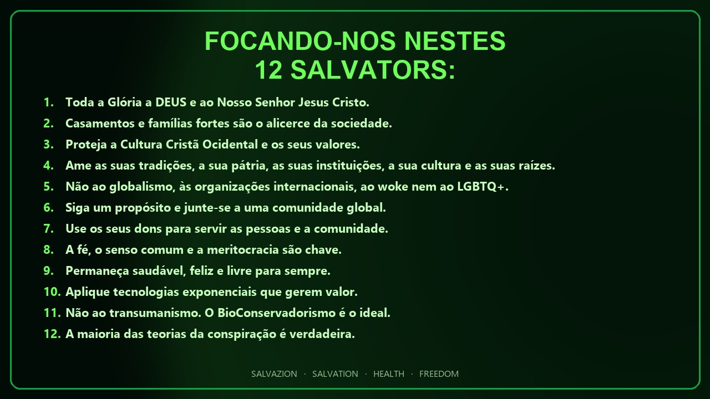

# 12 Salvators

**Idioma:** [English](https://welcome.salvazion.org/) · [Español](https://bienvenida.salvazion.org/) · Português

Não são slogans. São as doze convicções de um Green Lion King.

1. **Toda a Glória a DEUS e ao Nosso Senhor Jesus Cristo.**
2. **Casamentos e famílias fortes são o alicerce da sociedade.**
3. **Proteja a Cultura Cristã Ocidental e os seus valores.**
4. **Ame as suas tradições, a sua pátria, as suas instituições, a sua cultura e as suas raízes.**
5. **Não ao globalismo, às organizações internacionais, ao woke nem ao LGBTQ+.**
6. **Siga um propósito e junte-se a uma comunidade global.**
7. **Use os seus dons para servir as pessoas e a comunidade.**
8. **A fé, o senso comum e a meritocracia são chave.**
9. **Permaneça saudável, feliz e livre para sempre.**
10. **Aplique tecnologias exponenciais que gerem valor.**
11. **Não ao transumanismo. O BioConservadorismo é o ideal.**
12. **A maioria das teorias da conspiração é verdadeira.**

SALVAZION · SALVATION · HEALTH · FREEDOM


**Próximo.** [O Propósito](purpose.md) · [Crie sua conta grátis](https://salvazion.org/auth/signup)

