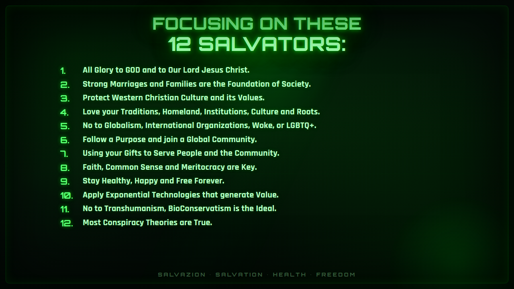

# 12 Salvators

These are not slogans. They are the twelve convictions of a Green Lion King. Read them before you create an account. Live them after you do.

1. **All Glory to GOD and to Our Lord Jesus Christ.**
2. **Strong Marriages and Families are the Foundation of Society.**
3. **Protect Western Christian Culture and its Values.**
4. **Love your Traditions, Homeland, Institutions, Culture and Roots.**
5. **No to Globalism, International Organizations, Woke, or LGBTQ+.**
6. **Follow a Purpose and join a Global Community.**
7. **Using your Gifts to Serve People and the Community.**
8. **Faith, Common Sense and Meritocracy are Key.**
9. **Stay Healthy, Happy and Free Forever.**
10. **Apply Exponential Technologies that generate Value.**
11. **No to Transhumanism, BioConservatism is the Ideal.**
12. **Most Conspiracy Theories are True.**

SALVAZION · SALVATION · HEALTH · FREEDOM

If these twelve sit in your bones, you are already one of us. The App is how you practice them daily. Premium is how you stop practicing them on a quota.


**Next.** [Learn the Purpose](readme.md) · [Create your free account](https://salvazion.org/auth/signup)

